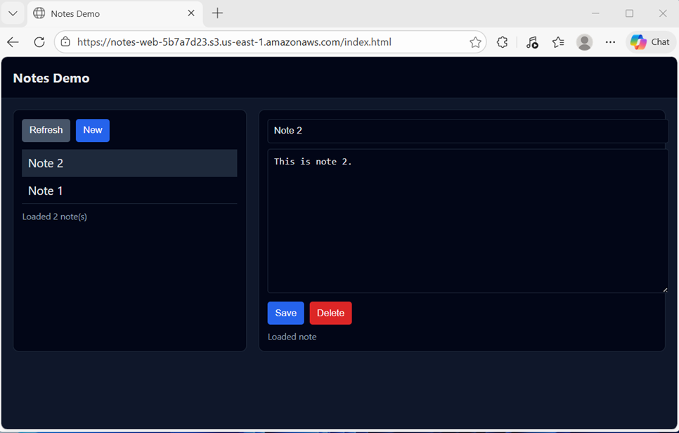
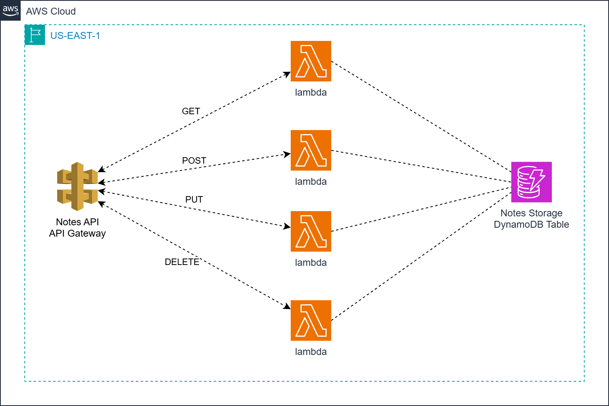

# AWS Serverless CRUD API with Lambda, DynamoDB, and API Gateway

This project delivers a fully automated **serverless CRUD (Create, Read, Update,
Delete) API** on AWS, built using **Amazon API Gateway**, **AWS Lambda**, and
**Amazon DynamoDB**.

It uses **Terraform** and **Python (boto3)** to provision and deploy a
**stateless, REST-style backend** that exposes HTTP endpoints for managing simple
“notes” data — all without running or managing any EC2 instances.

For testing and demonstration purposes, a lightweight **HTML web frontend**
interacts directly with the deployed API, allowing users to create, view, update,
and delete notes from a browser.



This design follows a **serverless microservice architecture** where API Gateway
routes requests to dedicated Lambda functions, DynamoDB provides fully managed
persistence, and AWS handles scaling, availability, and fault tolerance
automatically.



Key capabilities demonstrated:

1. **Serverless CRUD API** – Implements REST-style endpoints backed by Lambda
   functions for creating, retrieving, listing, updating, and deleting records.
2. **Stateless Compute Layer** – Each Lambda function is independent and
   stateless, enabling horizontal scaling and zero idle cost.
3. **Managed NoSQL Storage** – Uses DynamoDB with on-demand capacity for
   low-latency, fully managed data persistence.
4. **Infrastructure as Code (IaC)** – Terraform provisions API Gateway routes,
   Lambda functions, IAM roles, DynamoDB tables, and supporting resources in a
   repeatable, auditable way.
5. **Browser-Based Test Client** – A simple static HTML frontend demonstrates
   real-time interaction with the API without requiring additional tooling.

Together, these components form a **clean, minimal reference architecture** for
building serverless APIs on AWS — suitable for learning, prototyping, or extending
into more advanced event-driven and authenticated microservices.

## API Gateway Endpoints

The **Notes API** exposes REST-style CRUD endpoints through **Amazon API Gateway
(HTTP API)**. These endpoints allow clients to create, list, retrieve, update,
and delete notes stored in DynamoDB. All endpoints return JSON and work with
both CLI and browser-based clients.

> Note: In this simplified demo, the note `owner` is hardcoded to `"global"` in
> the Lambda handlers.

### API Endpoint Summary

| Method | Path | Purpose | Input | DynamoDB Operation |
|------|------|--------|------|--------------------|
| POST | `/notes` | Create a new note | JSON body (`title`, `note`) | `PutItem` |
| GET | `/notes` | List all notes | None | `Query` (owner = "global") |
| GET | `/notes/{id}` | Retrieve a single note by ID | Path param (`id`) | `GetItem` |
| PUT | `/notes/{id}` | Update an existing note | Path param + JSON body | `UpdateItem` |
| DELETE | `/notes/{id}` | Delete a note by ID | Path param (`id`) | `DeleteItem` |


### Request & Response Characteristics

| Aspect | Behavior |
|-----|--------|
| Authentication | None (demo-only) |
| Content Type | `application/json` |
| Owner Model | Hardcoded to `"global"` |
| Response Format | JSON |
| Clients | curl, browser, any HTTP client |
| Error Handling | Standard HTTP status codes |

---

### POST /notes

**Purpose:**  
Creates a new note in DynamoDB.

**Request Body (JSON):**
```json
{
  "title": "Test Note 1",
  "note": "This is test note 1"
}
```

**Parameters:**

| Field | Type | Required | Description |
|------|------|----------|-------------|
| title | string | Yes | Note title |
| note | string | Yes | Note body/content |

**Example Request:**
```bash
curl -s -X POST https://<api-id>.execute-api.us-east-1.amazonaws.com/notes \
  -H "Content-Type: application/json" \
  -d '{"title":"Test Note 1","note":"This is test note 1"}'
```

**Example Response (201):**
```json
{
  "id": "2f2d0c5a-9f5f-4d7d-9e2c-1c8a5b8e3c21",
  "title": "Test Note 1",
  "note": "This is test note 1"
}
```

---

### GET /notes

**Purpose:**  
Lists all notes for the demo owner (`"global"`).

**Example Request:**
```bash
curl -s https://<api-id>.execute-api.us-east-1.amazonaws.com/notes
```

**Example Response (200):**
```json
{
  "items": [
    {
      "owner": "global",
      "id": "2f2d0c5a-9f5f-4d7d-9e2c-1c8a5b8e3c21",
      "title": "Test Note 1",
      "note": "This is test note 1",
      "created_at": "2026-01-19T14:12:09.123456+00:00",
      "updated_at": "2026-01-19T14:12:09.123456+00:00"
    }
  ]
}
```

---

### GET /notes/{id}

**Purpose:**  
Retrieves a single note by ID.

**Example Request:**
```bash
curl -s https://<api-id>.execute-api.us-east-1.amazonaws.com/notes/<id>
```

---

### PUT /notes/{id}

**Purpose:**  
Updates an existing note.

**Request Body (JSON):**
```json
{
  "title": "Test Note 1",
  "note": "Updated note"
}
```

---

### DELETE /notes/{id}

**Purpose:**  
Deletes a note by ID.

**Example Request:**
```bash
curl -s -X DELETE https://<api-id>.execute-api.us-east-1.amazonaws.com/notes/<id>
```

## Prerequisites

* [An AWS Account](https://aws.amazon.com/console/)
* [Install AWS CLI](https://docs.aws.amazon.com/cli/latest/userguide/getting-started-install.html)
* [Install Terraform](https://developer.hashicorp.com/terraform/install)

If this is your first time following along, we recommend starting with this video:  
**[AWS + Terraform: Easy Setup](https://www.youtube.com/watch?v=9clW3VQLyxA)** – it walks through configuring your AWS credentials, Terraform backend, and CLI environment.

## Download this Repository

```bash
git clone https://github.com/mamonaco1973/aws-crud-example.git
cd aws-crud-example
```

## Build the Code

Run [check_env](check_env.sh) to validate your environment, then run [apply](apply.sh) to provision the infrastructure.

```bash
~/aws-crud-example$ ./apply.sh
NOTE: Running environment validation...
NOTE: Validating that required commands are found in your PATH.
NOTE: aws is found in the current PATH.
NOTE: terraform is found in the current PATH.
NOTE: jq is found in the current PATH.
NOTE: All required commands are available.
NOTE: Checking AWS cli connection.
NOTE: Successfully logged into AWS.

Initializing the backend...
```

### Build Results

When the deployment completes, the following resources are created:

- **Core Infrastructure:**  
  - Fully serverless architecture—no EC2 instances, containers, or VPC networking required  
  - Terraform-managed provisioning of API Gateway, Lambda, DynamoDB, and S3 resources  
  - Stateless, request-driven design where each API call is handled independently  

- **Security & IAM:**  
  - IAM roles for Lambda execution with scoped permissions for DynamoDB and CloudWatch  
  - Principle-of-least-privilege policies applied per Lambda function  
  - No long-lived credentials embedded in application code  

- **Amazon DynamoDB Table:**  
  - Single table storing notes keyed by `owner` (partition key) and `id` (sort key)  
  - Each item stores `title`, `note`, `created_at`, and `updated_at` attributes  
  - On-demand capacity mode for automatic scaling and cost efficiency  

- **AWS Lambda Functions:**  
  - Multiple Python-based Lambda functions implementing Create, Read, Update, List, and Delete operations  
  - Each function is independently deployed and mapped to a specific API route  
  - Emits structured logs to CloudWatch for observability and debugging  

- **Amazon API Gateway:**  
  - HTTP API exposing REST-style `/notes` and `/notes/{id}` endpoints  
  - Routes requests to the appropriate Lambda function based on HTTP method and path  
  - Provides secure, stateless HTTPS access for browser and CLI clients  

- **Static Web Application (S3):**  
  - S3 bucket configured for static website hosting  
  - `index.html` provides a lightweight browser-based interface for managing notes  
  - Frontend dynamically calls the deployed API Gateway endpoints  

- **Automation & Validation:**  
  - `apply.sh`, `destroy.sh`, and `check_env.sh` scripts automate provisioning, teardown, and environment validation  
  - `validate.sh` performs end-to-end API verification using curl and jq  
  - Entire workflow runs using Terraform and AWS CLI—no manual AWS console setup required  

Together, these resources form a **clean, minimal serverless CRUD application**
that demonstrates modern AWS API design principles—simple, scalable, and fully
managed from infrastructure to application code.

